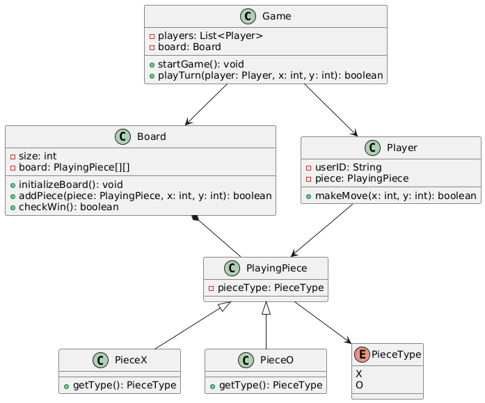

```text
class Game {
    - players: List<Player>
    - board: Board
    + startGame(): void
    + playTurn(player: Player, x: int, y: int): boolean
}

class Board {
    - size: int
    - board: PlayingPiece[][]
    + initializeBoard(): void
    + addPiece(piece: PlayingPiece, x: int, y: int): boolean
    + checkWin(): boolean
}

class Player {
    - userID: String
    - piece: PlayingPiece
    + makeMove(x: int, y: int): boolean
}

class PlayingPiece {
    - pieceType: PieceType
}

class PieceX {
    + getType(): PieceType
}

class PieceO {
    + getType(): PieceType
}

enum PieceType {
    X
    O
}

Game --> Player
Game --> Board
Board *-- PlayingPiece
Player --> PlayingPiece
PlayingPiece <|-- PieceX
PlayingPiece <|-- PieceO
PlayingPiece --> PieceType
```


